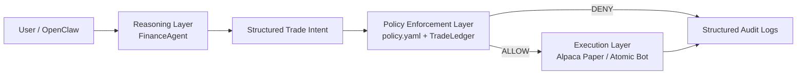

# OpenClaw Finance Agent

Secure Autonomous AI Trading Agent built for the Claw and Shield hackathon track. The system converts natural language trading requests into structured intents, validates them against a deterministic policy layer, and only then allows paper execution through approved backends.



## Problem Statement

Autonomous financial agents are powerful, but unsafe execution can lead to oversized trades, unauthorized assets, after-hours actions, and poor auditability. This prototype addresses that problem by making AI reasoning explainable and forcing every action through deterministic policy enforcement before execution.

## Solution Overview

This project combines:

- a reasoning layer that converts user text into JSON trade intents
- a YAML-backed policy engine that always returns `ALLOW` or `DENY`
- structured audit logs and ledger tracking for traceability
- a React dashboard for explainability, security visibility, and scenario simulation
- OpenClaw + MCP integration for agent orchestration

## Features

- Natural-language trade parsing into structured JSON intent
- Deterministic policy enforcement using `policy.yaml`
- Allowlist checks for symbols, actions, actors, and asset classes
- Per-order, per-symbol, and daily quantity limits
- Market-hours checks and optional blackout windows
- Structured JSONL audit trail in `audit.jsonl`
- Security status, policy reasoning, and timeline dashboard
- Scenario simulation for allowed and blocked trades
- Optional Alpaca paper-trading execution
- Optional ArmorIQ / Atomic Bot integration
- OpenClaw workspace skill and MCP server integration

## Tech Stack

- Backend: TypeScript, Node.js, Express
- Frontend: React, Vite, Tailwind CSS
- AI / Agent Layer: OpenClaw, MCP, Ollama, OpenRouter, OpenAI, Anthropic
- Enforcement: YAML policy model, custom PolicyEngine, TradeLedger
- Execution: Alpaca Paper Trading API, Atomic Bot / ArmorIQ client
- Logging: JSONL audit logs and ledger state files

## Project Structure

```text
.
|-- dashboard/                 # React dashboard for explainability and security views
|-- docs/                      # Architecture and OpenClaw setup notes
|-- skills/                    # OpenClaw workspace skill
|-- src/
|   |-- agent.ts               # Reasoning layer / model provider integration
|   |-- api-server.ts          # REST API for dashboard and demo flows
|   |-- executor.ts            # Alpaca / Atomic Bot execution
|   |-- ledger.ts              # Daily exposure tracking
|   |-- logger.ts              # Structured audit logging
|   |-- mcp-server.ts          # MCP tool surface for OpenClaw
|   |-- policy.ts              # Deterministic enforcement engine
|   `-- test.ts                # Parser and policy smoke tests
|-- policy.yaml                # Policy configuration
|-- .env.example               # Placeholder environment variables
`-- README.md
```

## Setup Instructions

### Prerequisites

- Node.js 18+
- npm
- One LLM provider:
  - Ollama locally, or
  - OpenRouter, OpenAI, or Anthropic API key
- Alpaca paper keys if you want live paper execution
- ArmorIQ / Atomic Bot key if you want that integration enabled

### Step 1: Install dependencies

```bash
npm install
cd dashboard && npm install
cd ..
```

### Step 2: Create local environment file

Copy the example file and fill in your own keys:

```bash
copy .env.example .env
```

Use placeholders only in the repository.  
Important: `.env` is excluded from git. `.env file will be submitted separately in the form`.

### Step 3: Configure environment variables

Supported variables are defined in `.env.example`:

```env
APCA_API_KEY_ID=YOUR_PAPER_KEY
APCA_API_SECRET_KEY=YOUR_PAPER_SECRET
APCA_API_BASE_URL=https://paper-api.alpaca.markets

LLM_PROVIDER=ollama
OLLAMA_MODEL=llama3
OLLAMA_BASE_URL=http://127.0.0.1:11434/api/generate

OPENROUTER_API_KEY=your_openrouter_api_key
OPENROUTER_MODEL=openrouter/free
OPENAI_API_KEY=your_openai_api_key
OPENAI_MODEL=gpt-4o-mini
ANTHROPIC_API_KEY=your_anthropic_api_key
ANTHROPIC_MODEL=claude-3-5-sonnet-latest

ARMORIQ_API_KEY=your_armoriq_api_key
ARMORIQ_BASE_URL=https://api.atomicbot.com/v1
USER_ID=your_user_id
AGENT_ID=openclaw_finance_agent
```

### Step 4: Review policy configuration

Edit `policy.yaml` if you want to change:

- approved symbols
- allowed asset classes
- per-order trade limit
- per-symbol daily limit
- daily aggregate limit
- market-hours-only behavior
- blackout windows

## How to Run the Project

### Run backend API

```bash
npm run api
```

Backend default URL: `http://localhost:4789`

### Run dashboard

```bash
npm run dashboard
```

Dashboard default URL: `http://localhost:4173`

### Run both together

```bash
npm run dev
```

### Run MCP server for OpenClaw

```bash
npm run mcp
```

### Run local console demo scenarios

```bash
npm run start
```

## How to Test the Project

### Typecheck + policy smoke tests

```bash
npm test
```

### Frontend build test

```bash
npm run dashboard:build
```

### Demo API tests

Allowed scenario:

```bash
curl -X POST http://localhost:4789/api/simulate/scenario ^
  -H "Content-Type: application/json" ^
  -d "{\"preset\":\"valid\"}"
```

Blocked scenario:

```bash
curl -X POST http://localhost:4789/api/simulate/scenario ^
  -H "Content-Type: application/json" ^
  -d "{\"preset\":\"oversized\"}"
```

## API Endpoints

### Core APIs

- `GET /api/health` - health check
- `GET /api/intent/latest` - last parsed intent
- `GET /api/policy/evaluation/:id` - specific policy evaluation
- `GET /api/policy/json` - current policy configuration
- `GET /api/ledger/status` - current ledger snapshot
- `GET /api/ledger` - alias for ledger snapshot
- `GET /api/audit/timeline` - structured audit timeline
- `GET /api/audit` - legacy text-formatted audit entries
- `GET /api/security/status` - allowed/blocked totals and threat summary
- `POST /api/simulate/scenario` - run a non-executing simulation
- `POST /api/intent/run` - run a scenario and optionally execute if allowed

### Optional execution data APIs

- `GET /api/portfolio` - lightweight demo portfolio response
- `GET /api/atomic-balance` - ArmorIQ / Atomic Bot balance
- `GET /api/atomic-history` - ArmorIQ / Atomic Bot transaction history

## Demo Instructions

1. Start the backend: `npm run api`
2. Start the dashboard: `npm run dashboard`
3. Open `http://localhost:4173`
4. Use the scenario buttons in the dashboard:
   - Valid Trade
   - Risk Violation (Oversized)
   - Unauthorized Asset
   - After-Hours Violation
5. Show:
   - parsed intent
   - rule-by-rule policy reasoning
   - final allow/deny badge
   - audit timeline
   - security summary

Recommended hackathon flow:

- Allowed example: `buy 1 share of AAPL`
- Blocked example: `buy 15 shares of MSFT`

## Screenshots

Screenshots are not stored in the repository yet. Recommended captures for submission:

- Security Overview panel
- Policy Enforcement Layer panel
- Attack Simulation panel
- Audit Timeline panel

## Deployment

This project now supports a simple production deployment path:

1. Build the dashboard:

```bash
npm run dashboard:build
```

2. Start the API server:

```bash
npm run api
```

If `dashboard/dist` exists, the backend serves the built frontend on the same origin as the API.

Production URL pattern:

- Dashboard: `http://your-host:4789`
- API: `http://your-host:4789/api/*`

If you deploy the dashboard separately as a static site, create `dashboard/.env` from `dashboard/.env.example` and set `VITE_API_BASE_URL` to your backend origin or API base.

Deployment URL: Not available

## OpenClaw Integration

- Workspace skill: `skills/openclaw-finance-guardian/`
- Integration guide: `docs/OPENCLAW_INTEGRATION.md`
- MCP server entry point: `src/mcp-server.ts`

## Additional Submissions

- Demo Video Link: Not available yet
- Figma Design Link: Not available yet

## Submission Checklist

- Repo clean ✅
- README complete ✅
- No restricted folders committed ✅
- `.env` excluded ✅

## Compliance Notes

- `node_modules/`, `.build/`, `.env`, and `__pycache__/` are gitignored
- placeholder values live in `.env.example`
- local secrets are not committed
- `.env file will be submitted separately in the form`
