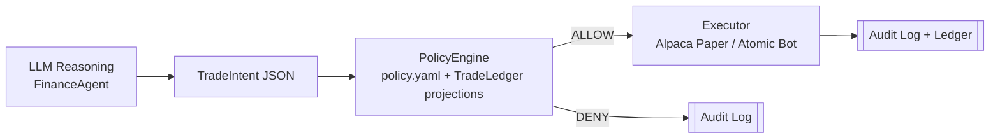

# OpenClaw Finance Agent

A fully local, autonomous financial trading agent built using the OpenClaw framework. This project demonstrates a secure architecture that strictly separates LLM-based reasoning from deterministic execution. It utilizes a JSON-based intent model and a YAML-driven policy engine to deterministically enforce boundaries to limit the risk of an AI agent acting directly in live capital markets. It supports executing paper trades via the Alpaca API and includes a fully functional Model Context Protocol (MCP) Server for integration with other LLM platforms.



## Features
- **Deterministic Action Boundaries:** Separates "reasoning/intent" generation (LLM) from deterministic runtime action via `ArmorClaw`/YAML engines.
- **Strict Policy Engine:** Restricts the agent via `policy.yaml` (e.g. limiting trade limits, blocking unsafe asset classes, restricting unapproved tickers).
- **Alpaca Paper Trading Integration:** Live deterministic execution on a test brokerage.
- **Local Ollama Integration:** Recommends running entirely locally for 100% data-privacy (fallback mocks logic if Ollama isn't found).
- **Comprehensive Audit Logs:** Keeps record of generated intents, policy engine checks, and execution status securely inside `audit.log`.
- **Daily Ledger & Market Hours Enforcement:** Declarative policies enforce per-order, per-symbol daily, and daily aggregate quantity caps; market-hours-only trading; optional blackout windows; ticker/asset-class allowlists; and delegated caps. Ledger state is persisted in `state/trade-ledger.json`.
- **MCP Server:** Provides standard `mcp` server capabilities to let external AI clients control the agent and review audits.

## Getting Started

### Prerequisites

Ensure you have Node.js and `npm` installed.

### Setup

1. **Clone & Install Dependencies**
   ```bash
   npm install
   ```

2. **Environment Configuration**
   Copy `.env.example` to `.env` and provide your Alpaca paper trading credentials:
   ```bash
   cp .env.example .env
   ```
   **Update the variables in `.env`:**
   ```env
   APCA_API_KEY_ID=your_alpaca_key_here
   APCA_API_SECRET_KEY=your_alpaca_secret_here
   APCA_API_BASE_URL=https://paper-api.alpaca.markets
   OLLAMA_MODEL=llama3
   ```

3. **(Optional) Run Ollama locally**
   Start your local `ollama` instance with `llama3`. If `ollama` isn't running, the agent will gracefully mock intents based on the test string parsing.

### Policy Configuration
- Edit `policy.yaml` to set:
  - `approved_symbols`, `allowed_asset_classes`, `allowed_actions`, `allowed_actors`
  - `per_order_max_qty`, `per_symbol_daily_max_qty`, `daily_max_qty`
  - `market_hours_only` (set to `false` if you need to demo after-hours)
  - `blackout.start` / `blackout.end` ISO timestamps for temporary blocks
- Successful executions increment the daily ledger in `state/trade-ledger.json`; policy evaluation uses the projected totals (aggregate and per-symbol) before executing. Delegated trades must not exceed `delegated_limit` when provided.

## Usage

### Run Test Scenarios locally
Run the local console demonstration. It covers: allowed AAPL trade, oversized MSFT trade (blocked by per-order cap), disallowed crypto trade, allowed delegated NVDA trade, and blocked delegated NVDA trade (delegation cap).
```bash
npm run start
```

### Run Model Context Protocol (MCP) Server
Launch the standard STDIO MCP server interface to allow conversational assistants to integrate with your local instance of OpenClaw:
```bash
npm run mcp
```
The server provides tools for:
- `execute_trading_scenario`: Parse a string using OpenClaw agent and execute it strictly within `policy.yaml` bounding box (args: `scenario`, optional `use_atomic_bot`, `actor`, `delegated_limit`).
- `get_audit_logs`: Fetch the recent line tail from `audit.log`.

## Policies Mapping
To edit the deterministic behaviors of the agent's bounding box, refer to `policy.yaml`!

## Dashboard (new)
- APIs: `npm run dashboard:api` (serves policy/ledger/audit + Alpaca balance at http://localhost:4789).
- Frontend: `cd dashboard && npm run dev` (Vite dev server http://localhost:4173, proxied to the API).
- Build: `npm run dashboard:build`.
- The dashboard shows live audit tail, policy limits, ledger totals, portfolio info, and a market-hours toggle (writes back to `policy.yaml`).

Happy Safe Trading!
